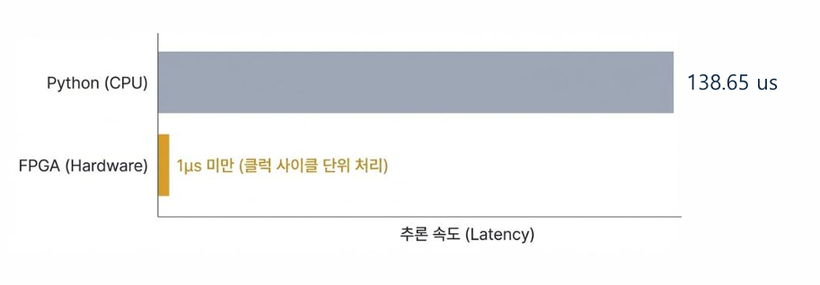
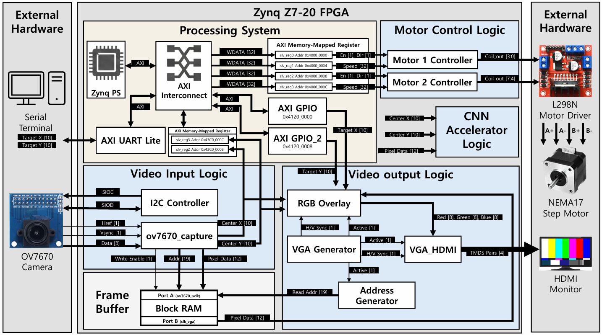

#  FPGA-based Edge AI Object Alignment System (w/ CNN Accelerator)

> **"PC 없는 독립형 엣지 시스템: 138배 빠른 하드웨어 가속기 설계"**

Zynq-7000 SoC를 활용하여 카메라 영상 속 객체를 실시간으로 추적하여 중앙에 정렬(Alignment)하고, 정렬된 객체를 **CNN 가속기(Inference)로 식별**하는 엣지 시스템입니다.
Software(CPU) 방식의 한계를 극복하기 위해 **Line Buffer 기반의 스트리밍 아키텍처**를 적용하여 **Zero-Latency**를 달성했습니다.

---

## Performance Highlight (핵심 성과)

###  Python(SW) vs FPGA(HW) 속도 비교
가장 중요한 성과는 **순차 처리(CPU)**와 **병렬 처리(FPGA)**의 성능 차이를 정량적으로 검증한 것입니다.

| Platform | Processing Time (Latency) | Speedup | Note |
| :--- | :--- | :--- | :--- |
| **Python (CPU)** | 19.21 ms | 1x | 순차적 메모리 접근 및 연산 |
| **FPGA (PL)** | **0.138 ms** | **~138x** | **Pipeline 병렬 연산 (Streaming)** |

> **Why so fast?**
> 외부 DDR 메모리를 거치지 않고, FPGA 내부의 On-chip Memory(BRAM)를 활용하여 데이터가 들어오는 즉시 연산이 완료되는 **DRAM-less Architecture**를 구현했습니다.

---

##  System Architecture (전체 구조)

시스템은 **PS(Processing System)**와 **PL(Programmable Logic)**이 AXI Bus로 연결된 **이기종 컴퓨팅(Heterogeneous Computing)** 구조입니다.

### 1. Programmable Logic (Hardware Area)
* **Camera Interface:** OV7670 센서의 Raw 데이터를 클럭 단위로 수신.
* **Stage Module:** `Line Buffer`를 이용해 프레임 버퍼 없이 실시간으로 객체 좌표(X,Y) 추출.
* **CNN Accelerator:** `Conv` → `Pooling` → `ReLU` 레이어를 하드웨어 파이프라인으로 구현.

### 2. Processing System (Software Area)
* **Main FSM:** 전체 시스템의 상태(Tracking, Alignment, Inference) 관리.
* **Motor Controller:** 추론 결과에 따라 스텝 모터(NEMA17)를 제어하여 객체 이동.

---

##  Demo & Result (동작 영상)

실제 FPGA 보드에서 카메라 입력에 따라 모터가 반응하고 추론하는 모습입니다.

### 1. Tracking & Alignment (Stage Demo)

[▶ 영상 보기](images/stage.mp4)  

### 2. CNN Inference (CNN Demo)

[▶ 영상 보기](images/video_i.mp4)

---

##  Repository Structure

* `verilog/`: Vivado H/W 소스 (Stage 모듈과 CNN 모듈 독립 구성)
* `vitis/`: 객체 추적 및 모터 제어를 담당하는 펌웨어 (Stage 제어용)
* `python/`: CNN 모델 학습 및 가중치 양자화 (Quantization)
* `images/`: 프로젝트 데모 영상 및 아키텍처 이미지
* `docs/`: 시스템 블록도 및 발표 자료

---

## 📬 Contact
* **Author:** [류우상]
* **Email:** [rys32@naver.com]
